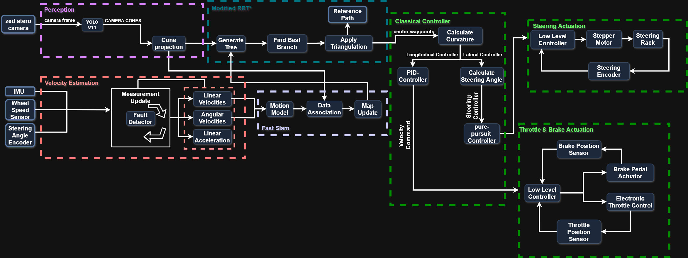

<div align="center">

# 🏎️ Autonomous Racing Car — Formula Student Driverless Stack

**A full self-driving software pipeline for a Formula Student Driverless race car — perception, localization, planning, and control — built on ROS and validated in a Gazebo simulation.**

<!-- 👉 Replace the badges' colors/text only if you want. These render automatically. -->


</div>

---

## 🎥 Demo
<!-- OPTION 1: YouTube thumbnail that links to the video.
     Replace VIDEO_ID in both URLs. -->
[](https://youtu.be/jIS6mQgD91I)

<!-- OPTION 2: inline GIF (uncomment and add the file to docs/)

-->

A lap driven fully autonomously in the Gazebo simulation: the car detects cones, builds the track with SLAM, plans a path, and follows it under closed-loop control.
---

## 📌 Overview

This project is a complete **autonomous driving software stack for a Formula Student Driverless (FS-AI) race car**. Given only a track outlined by colored cones, the vehicle perceives its surroundings, estimates its own motion, maps the track, plans a racing line, and controls steering and throttle to complete laps — with no human input.

The entire stack is developed in **ROS** and validated in a **Gazebo** physics simulation before deployment to the real vehicle.

 This was my graduation project with Formula Student team **AAM** at **Arab Academy for Science and Technology**.

---

## 🎯 My Contribution

This is a multi-person Formula Student project. I personally designedand implemented two of its core subsystems:

### 🎮 Control
- **Model Predictive Control (MPC) in Python** — a **linear time-varying (LTV) MPC** built on a kinematic bicycle model with a 10-step horizon (10 Hz). At each step the dynamics are linearized and the problem is formulated as a **quadratic program solved online with OSQP**, optimizing steering and acceleration over the state `[x, y, ψ, v]` to track the reference path.
- **Curvature-aware speed profiling** — the controller estimates path curvature ahead and adapts target speed accordingly, braking into corners and accelerating on straights.
- **Waypoint smoothing** — a moving-average filter over recent waypoint history stabilizes the reference path and reduces jitter in the control commands.
- **Classical control baselines** — I also implemented **Pure Pursuit**, **Stanley**, and **PID** controllers to benchmark the MPC against established methods.

### 🗺️ SLAM & Localization
- **FastSLAM with an EKF** — a particle-filter SLAM implementation (20 particles) where each particle maintains its own map, with **per-particle Extended Kalman Filter** updates for cone landmark positions and **loop-closure detection** to correct drift over a full lap.

*(The perception, state-estimation, path-planning, and simulation packages were built by other team members and are included here so the full stack runs end-to-end.)*

---

## ✨ Key Features

- **End-to-end autonomy** — a full perceive → estimate → map → plan → control loop running in real time on ROS.
- **Dual-sensor perception** — cone detection from a **camera (YOLOv5)** fused into a single obstacle map.
- **SLAM & localization** — **FastSLAM** (particle filter) with **per-particle EKF** landmark updates and loop closure builds a map of the track and localizes the car within it.
- **Path planning** — **RRT-based** exploration plus midline generation from cone pairs to produce a drivable racing line.
- **Multiple controllers** — a **linear time-varying MPC (Python, OSQP)** with curvature-aware speed profiling, plus classical baselines (**Pure Pursuit, Stanley, PID**) for benchmarking.
- **Hardware-ready** — CAN interface (`VCU2AI` / `AI2VCU`) to command the real vehicle's actuators.
- **Simulation-first** — reproducible testing on standard FSD missions (acceleration, skidpad, trackdrive) in Gazebo.

---

## 🧠 System Architecture

<div align="center">



</div>

Each stage is an independent ROS package that communicates over topics, so modules can be developed, tested, and swapped in isolation.

Each stage is an independent ROS package that communicates over topics, so modules can be developed, tested, and swapped in isolation.

---

## 🗂️ Repository Structure

```
grad_proj/
├── src/
│   ├── AAM_PERCEPTION/        # Camera (YOLOv5) 
│   ├── AAM_STATE_ESTIMATION/  # Velocity / motion estimation from IMU
│   ├── AAM_LOCALIZATION/      # FastSLAM + EKF mapping & localization
│   ├── AAM_PATH_PLANNING/     # RRT planner + midline racing-line generation
│   ├── AAM_CONTROL/           # MPC, Pure Pursuit, Stanley, PID + CAN interface
│   ├── aam_cars/              # Vehicle model, sensors & Gazebo tracks (EUFS-based)
│   ├── LAUNCH/                # Top-level launch files to bring up the stack
│   └── PLUGINS/               # Simulation / mission plugins
└── README.md
```
---

## 🛠️ Tech Stack

| Area | Tools |
|------|-------|
| **Middleware** | ROS Noetic (catkin) |
| **Languages** | C++17, Python 3 |
| **Simulation** | Gazebo, RViz |
| **Perception** | YOLOv5, OpenCV) |
| **Estimation** | FastSLAM, Extended Kalman Filter |
| **Control** | Model Predictive Control (OSQP QP solver), Pure Pursuit, Stanley, PID |
| **Vehicle I/O** | CAN bus (VCU ↔ AI) |

---

## 🚀 Getting Started

### Prerequisites
- Ubuntu 20.04
- [ROS Noetic](http://wiki.ros.org/noetic/Installation/Ubuntu)
- Gazebo 11
- Python 3.8+ with the packages in `requirements.txt` <!-- 👉 add one if you don't have it -->

### Build
```bash
# Clone into a catkin workspace
mkdir -p ~/catkin_ws/src && cd ~/catkin_ws/src
git clone https://github.com/youssefaladin/grad_proj.git .

# Build
cd ~/catkin_ws
catkin_make        # or: catkin build
source devel/setup.bash
```

### Run the simulation
```bash
# 👉 Replace with your actual top-level launch command(s).
# Example:
roslaunch LAUNCH bringup.launch          # brings up the full autonomous stack
roslaunch aam_cars small_track.launch    # loads the Gazebo track
```

> 👉 List the real launch files a user should run, in order. This is the #1 thing that makes a repo look "finished" — someone can actually run it.

---

## 📊 Results

| Mission | Result |
|---------|--------|
| Acceleration | ✅ Completed |
| Skidpad | ✅ Completed |
| Trackdrive | ✅ Completed |

---

## 🧭 Roadmap / Future Work

- [ ] Real-time perception on embedded hardware
- [ ] Sensor fusion improvements (camera–LiDAR calibration)
- [ ] Learning-based racing-line optimization
- [ ] Full deployment & testing on the physical vehicle

---

## 🙏 Acknowledgements

This project builds on excellent open-source work:
- **[EUFS Simulator](https://gitlab.com/eufs/eufs_sim)** — vehicle model, sensors, and track assets used in the Gazebo simulation.
- **[YOLOv5](https://github.com/ultralytics/yolov5)** by Ultralytics — camera cone detection.
- **[MA-RRT path planning](https://github.com/AutonomicManipulation/ma_rrt_path_plan)** — RRT reference implementation.

---

## 👤 Author

**Youssef Alaa Eldin Hamada** <!-- 👉 -->
Control & Localization Engineer — Formula Student team AAM
**Hazem Mohamed Belal** <!-- 👉 -->
Path Planning — Formula Student team AAM
*(Implemented RRT Algorithm)*
**Amr El-Meligy** <!-- 👉 -->
State estimation — Formula Student team AAM
**Karim Abo El-Azam** <!-- 👉 -->
 Perciption— Formula Student team AAM
 **Abdelrahman bassiouny** <!-- 👉 -->
 Perciption— Formula Student team AAM

[](https://www.linkedin.com/in/youssef-aladdin-a58056301/)
[](mailto:youssefaladdinn@gmail.com)

---

